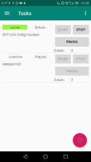
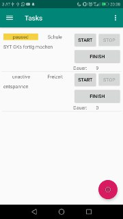
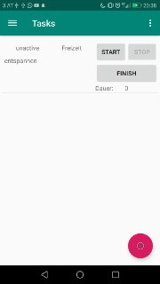
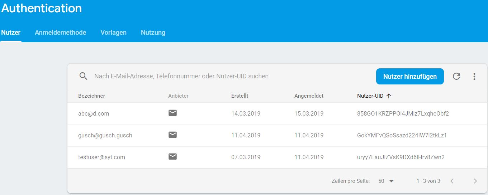
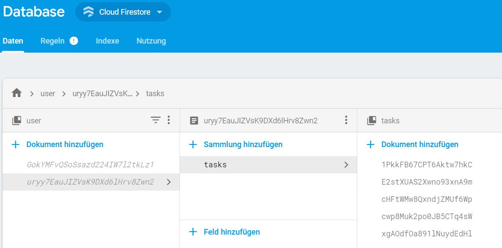

# "*Mobile Synchronisation*"

## Aufgabenstellung
Die detaillierte [Aufgabenstellung](TASK.md) beschreibt die notwendigen Schritte zur Realisierung.

## Endergebnis - Taskliste
Die fertige Taskliste enthält alle noch nicht beendeten Tasks des Benutzers. Er hat die Möglichkeit einen beliebigen Task zu starten. Sobald ein Task gestartet ist, läuft der Timer. Wie man erkennen kann, kann immer nur ein Task gleichzeitig gestartet werden. (Bild 1)  
Wenn der Task pausiert wurde, wird das visuell hervorgehoben und alle Tasks sind wieder startbereit. (Bild 2)  
Wenn der Task beendet wird, wird er aus der Taskliste entfernt. (Bild3)  



## Implementierung

Für die Synchronisation und Persistierung der Tasks wurde  Firebase verwendet. Die Funktionen, die davon für das Projekt verwendet wurden sind "Authentication" für Login/Register und "Firestore" als Datenbank. Firebase kümmert sich dabei selbst darum, dass wenn neue Daten in der Datenbank sind, die App das mitbekommt. Was dann genau mit den neuen Daten gemacht werden soll, muss durch den Programmierer bestimmt werden. (Mehr dazu später)  

In der [Firebase Dokumentation](https://firebase.google.com/docs/android/setup) sind alle Komponenten beschrieben und wie man diese in ein Android Studio Projekt einfügen kann, beziehungsweise welche verschiedenen Methoden für verschiedenste Anforderungen vorhanden sind.

Alternativ könnte das Speichern und die Synchronisation auch selbst programmiert werden. Da Firebase aber wie perfekt für den Anwendungszweck gemacht ist, wird im weiteren nicht weiter darauf eingegangen und nur die Umsetzung mit Firebase erklärt.

### __Was ist Firebase?__

Firebase ist eine Plattform für die Entwicklung von Mobil- und Webanwendungen, die 2011 von Firebase, Inc. entwickelt und 2014 von Google übernommen wurde. Seit Oktober 2018 umfasst die Firebase-Plattform 18 Produkte , die von 1,5 Millionen Apps verwendet werden.

Unter diesen Produkten gibt es beispielweise **Firebase Auth**, welches eine einfach bedienbare Authentifikationsmöglichkeit über Firebase bietet oder **Realtime database**, das ein Service mit einer NoSQL-Datenbank ist und dem Entwickler eine API für Synchronisierung über Clients und Datenspeicherung in der Cloud bietet.

### __Aufbau der App__
Die Programmierung der App erfolgt in Java. Das Frontend kann mit XML-Files bestimmt werden.  
Sobald der Benutzer die App startet wird überprüft ob er angemeldet ist. Falls das nicht der Fall ist, wird die Login-View gestartet, in der der Benutzer seine vorhanden Anmeldedaten (Email, Passwort) eingeben muss. -> Da ein Registrieren in der App nicht Teil der Anforderungen war, wurde es weggelassen. Registriert werden kann ein Benutzer manuell über die Firebase-Console (Alle Firebase Einstellungen dort zu finden.)  

In der App werden dem Benutzer alle seine individuellen Tasks angezeigt. Diese können gestartet/gestoppt und final beendet werden.  
Sobald sie beendet sind findet der Benutzer sie in einem anderen Fenster mit der dazugehörigen Bearbeitungsdauer.

#### Wichtige Android-Methoden
Es gibt die Möglichkeit Code beim Erstellen und beim Öffnen der App ausführen zu lassen. Dieser muss dafür in der Methode __onCreate()__ oder in der __onStart()__ Methode geschrieben werden.

### __Firebase-Komponenten verwenden__
Damit die Firebase-Komponenten in der App verwendet werden können müssen im _app/build.gradle_ File folgende dependencies eingefügt werden:  
```
dependencies{
    ...
    implementation 'com.google.firebase:firebase-database:16.0.6'
    implementation 'com.google.firebase:firebase-core:16.0.4'
    implementation 'com.google.firebase:firebase-auth:16.1.0'
    implementation 'com.google.firebase:firebase-firestore:18.1.0'
}
```
Weiters muss ganz unten im File folgende Line hinzugefügt werden:  
```
apply plugin: 'com.google.gms.google-services'
```

### __Authentifizierung - "Firebase Authentication"__
Für die Authentifizierung wurde __Firebase-Authentication__ verwendet. Um diese Firebase-Komponente zu verwenden wird beim Erstellen der App, in der Klasse _EmailPasswordActivity_ in der _onCreate()_-Methode, die private Variable _mAuth_ initialisiert. Diese wird im späteren Verlauf verwendet, um die Authentifizierungs-Methoden von Firebase ansprechen zu können.
```java
// Initialize Firebase Auth
mAuth = FirebaseAuth.getInstance();
```
__Beim Starten__ der App wird überprüft ob der Benutzer bereits bei Firebase angemeldet ist. Falls nicht, liefert die Methode _getCurrentUser()_ _null_ zurück.
```java
@Override
public void onStart() {
    super.onStart();

    // Check if user is signed in (non-null) and update UI accordingly.
    FirebaseUser currentUser = mAuth.getCurrentUser();
    updateUI(currentUser, null);
}
```
Gibt es einen angemelden User, dann werden dessen Tasks angezeigt. Andernfalls wird ein Fenster geöffnet, in dem der Benutzer sich anmelden kann.  

Mit der Methode _signInWithEmailAndPassword()_ wird die Authentifizierung bei Firebase gemacht.
```java
mAuth.signInWithEmailAndPassword(email, password)
```
An diese Methode kann ein _OnCompleteListener_ gehängt werden. Dieser kann dann auf das Authentifizierungsergebnis (eingeloggt/Fehler) reagieren.
```java
.addOnCompleteListener(this, new OnCompleteListener<AuthResult>() {
@Override
public void onComplete(@NonNull Task<AuthResult> task) {
    if (task.isSuccessful()) {
        // ...
    } else {
        // ...
    }
```
Für das __Ausloggen__ wird die Methode _mAuth.signOut()_ verwendet.  

War das Einloggen erfolgreich, dann wird in der Methode _updateUI()_ die neue Activity gestartet, die die Tasks des Users beinhaltet. Die Login-Activity wird daraufhin beendet, damit der Benutzer, beim Klicken des "Zurück-Buttons" auf seinem Smartphone, nicht wieder zur Login-Activity zurück kommen kann.
```java
//Start new activity
Intent i = new Intent(this, Tasks.class);
startActivity(i);
//Finish old activity
finish();
```
#### Gespeicherte Benutzer
Neue Benutzer können in der Firebase Console, im Authentication Register, hinzugefügt und verwaltet werden.


### __Datenbank - "Firestore"__
Firebase stellt für die Persisitierung von Daten zwei verschiedene Datenbanksysteme zur Verfügung. In diesem Projekt wurde "Firestore" gewählt, da das das neuere System von beiden ist und mehr Funktionen enthält.  
Im Firestore werden Daten in Form von Collections und Documents gespeichert. Collections können Dokumente enthalten und die wiederrum weitere Collections.

Um gespeicherte Tasks genau einem Benutzer zuweisen zu können wurde ein Schema gewählt, in dem die unique BenutzerID als Name des Documents dient. In diesem Dokument ist dann eine task-Collection, die alle Tasks des Benutzers in Form eines Dokuments mit den Feldern "createdOn", "description", "state", "taskTag" und "user_id" speichert.


Wird beim Speichern eines Tasks kein Name angegeben, dann wird von Firebase ein zufälliger Erstellt, wie man im Bild oben erkennen kann.

### __Tasks aus der Datenbank auslesen__
So werden Tasks aus der DB ausgelesen:
```java
db.collection("user").document(userID).collection("tasks").addSnapshotListener(new EventListener<QuerySnapshot>() {
    @Override
    public void onEvent(@javax.annotation.Nullable QuerySnapshot queryDocumentSnapshots, @javax.annotation.Nullable FirebaseFirestoreException exception) {
        if (exception != null) {
            Log.w(TAG, "Listen failed.", exception);
            return;
        }
        if (queryDocumentSnapshots != null) {
            //Clear the list
            items.clear();
            //Get all documents
            List<DocumentSnapshot> listOfDocuments = queryDocumentSnapshots.getDocuments();
            for (DocumentSnapshot doc : listOfDocuments) {
                //Create Task Object out of data
                Task t = doc.toObject(Task.class);
                //Setting docID field in db if not already set
                if(t.getDocumentID() == null){
                    t.setDocumentID(doc.getId());
                    updateTaskInDb(t);
                }
                items.add(t);
            }
            itemsadapter.notifyDataSetChanged();
        } else {
            Log.d(TAG, "Current data: null");
        }
    }
});
```
Die ausgelesenen Tasks werden daraufhin in einer Liste gespeichert, deren Elemente dann über den CustomTaskAdapter in der GUI angezeigt werden.
```java
final ArrayList<Task> items = new ArrayList<Task>();
final ArrayAdapter<Task> itemsadapter = new CustomTaskAdapter(this, items);
```
Diesem ArrayAdapter wird beim Holen der Daten gemeldet, dass sich etwas geändert hat. Daraufhin aktualisiert er die GUI.
```java
itemsadapter.notifyDataSetChanged();
```
Die Verknüpfung des Adapters mit dem Element der GUI erfolgt in diesem Schritt:
```java
listView = findViewById(R.id.listviewtasks);
listView.setAdapter(itemsadapter);
```

Wenn Daten aus der Datenbank ausgelesen werden, wird dem TaskObjekt der Name des Dokuments als Variable zugewiesen, welche dann wiederrum im späteren Verlauf in der Datenbank als Feld des Dokuments gespeichert wird. Das ist notwendig um später von einem spezifischen Task auf dessen Dokumentennamen zu kommen. (wichtig beim Updaten)
```java
//Setting docID field in db if not already set
if(t.getDocumentID() == null){
    t.setDocumentID(doc.getId());
    updateTaskInDb(t);
}
```

### __Neue Tasks erstellen__
Beim Erstellen neuer Tasks muss ein Task Objekt erstellt werden, welches dann wiederrum der Firebase Methode 'add()' als Parameter mitgegeben wird.
```java
FirebaseFirestore db = FirebaseFirestore.getInstance();
if(getCurrentUserID() != null) {
    db.collection("user").document(getCurrentUserID()).collection("tasks").add(t);
}
```
Mit der 'getCurrentUser()' Methode wird überprüft ob der Benutzer angemeldet ist.
```java
public String getCurrentUserID() {
    //Get userID of current user
    FirebaseAuth mAuth = FirebaseAuth.getInstance();
    return mAuth.getUid();
}
```

### __Daten in der DB updaten__
Immer wenn Tasks gestartet, gestoppt, beendet werden oder wenn sich die Taskdauer ändert, wird der bestimmte Datensatz im Firestore upgedated.  
Um den richtigen Datensatz zu finden wird mit der _documentID_ gearbeitet. Diese ID ist der Name des Datensatzes in der Datenbank, der nebenbei auch im Task Objekt gespeichert wird.  
Diese Task ID wird beim Updaten zuerst vom Task geholt und anschließend für die _set()_ Methode verwendet.
```java
String docID = t.getDocumentID();
...
db.collection("user").document(getCurrentUserID()).collection("tasks").document(docID).set(t)
...
```

### __Task starten__
Beim Starten eines Tasks wird zu aller erst überprüft ob es bereits ein andere Task als _aktiv_ gekennzeichnet ist. Es ist allerdings auch nicht möglich einen anderen Task zu starten, da beim Starten alle anderen 'Start'-Buttons disabled werden. Nach der Überprüfung wird der Timer gestartet und zum aktuellen Duration-Wert pro Sekunde '1' dazugezählt.
```java
T = new Timer();
...
T.scheduleAtFixedRate(new TimerTask() {
    @Override
    public void run() {
        runOnUiThread(new Runnable() {
            @Override
            public void run() {
                //Increase taskduration counter
                int count = Integer.parseInt(((TextView) v.findViewById(R.id.taskDuration)).getText().toString());
                count++;
                ((TextView) v.findViewById(R.id.taskDuration)).setText(String.valueOf(count));

                //Enable Finish Button Disable Start Button
                (v.findViewById(R.id.startButton)).setEnabled(false);
                (v.findViewById(R.id.stopButton)).setEnabled(true);
                (v.findViewById(R.id.finishButton)).setEnabled(true);

                //Set Background Color of active Task
                ((TextView) v.findViewById(R.id.taskStatus)).setText("active");
                ((TextView) v.findViewById(R.id.taskStatus)).setBackgroundColor(Color.rgb(155, 244, 66));

                task.setTaskDuration(count);
                task.setState("active");
                updateTaskInDb(task);
            }
        });
    }
}, 1000, 1000);
```

Um die Funktionalität der App zu sichern ist der Stop und der Finish Button erst dann für den Benutzer verfügbar, wenn der Task gestartet ist. Sobald ein Task gestartet ist, werden die Buttons aller anderer Tasks disabled.

### __Taks stoppen__
Beim Stoppen eines Tasks wird der aktive Timer gestoppt, der Status des Tasks geändert und anschließend die Dauer und der Status in der Datenbank gespeichert.  
Um den Timer zu stoppen wird die Methode _T.cancel();_ verwendet.  

### __Task beenden__
Beim Beenden eines Tasks, wird der Task aus der "task" Collection in der Datenbank in die Collection "finishedTasks" verschoben. Das hat zur Folge, dass der Task nicht mehr auf der Seite der aktiven Tasks angezeigt wird.

Um in der Datenbank Daten zu löschen kann die Funktion 'delete()' verwendet werden. Wenn ein Task gelöscht werden soll, wird dessen Status auf _finished_ gesetzt und anschließend die _updateTaskInDb()_ Methode aufgerufen. In dieser wird der Task anschließend so behandelt, wie oben beschrieben
```java
if(t.getState().toString().equals("finished")){
    //First add the finished task to other collection
    db.collection("user").document(getCurrentUserID()).collection("finishedTasks")  
    .document(docID).set(t)
    //Then remove task from active tasks
    db.collection("user").document(getCurrentUserID()).collection("tasks")  
    .document(docID).delete()
}
```

## Replikationsansatz
Als Replikationssatz könnten die Tasks auch lokal gespeichert werden und immer beim Starten/Stoppen/Beenden eines Tasks die lokalen Daten überschrieben werden. Dies wurde allerdings aus Zeitmangel nicht realisiert.

## Quellen
[Firebase Dokumentation](https://firebase.google.com/docs/android/setup)
